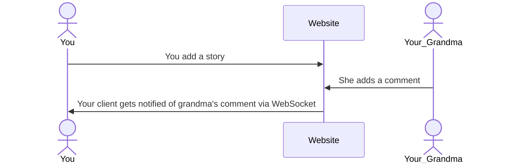

# Memory Box

Memory Box is a web-app for collecting, organizing and presenting family memories in a fashion suitable for all ages. Initial version was built for my university web development class and features a text-only approach, hopefully i'll have time to extend this into a full self-hosted app with more types of media and timeline.

[memorybox.click](memorybox.click)

> [!NOTE]
> This project uses a weak-copyleft license to guarantee openness, please read the license before contributing 

[My Notes](notes.md)

## 🚀 Specification Deliverable

For this deliverable I did the following. I checked the box `[x]` and added a description for things I completed.

- [x] Proper use of Markdown
- [x] A concise and compelling elevator pitch
- [x] Description of key features
- [x] Description of how you will use each technology
- [x] One or more rough sketches of your application. Images must be embedded in this file using Markdown image references.

### Elevator pitch

I love hearing my grandparents stories, but they, and I, won't always be around to hear them. It's so hard to gather, organize and present family stories and artifacts. Existing solutions like FamilySearch Memories, in my opinion, fails at being friendly to non-tech savvy audiences and often is [public](https://www.familysearch.org/en/memories/find). This app is planning on filling that need.

### Design

A focus on minimal login to help with less technical users. Under each story users can comment to add to the stories. 

```mermaid
sequenceDiagram
    actor You
    participant Website
    actor Your_Grandma
    You->>Website: You add a story
    Your_Grandma->>Website: She adds a comment
    Website->>You: Your client gets notified of grandma's comment via WebSocket
```

### Key features

- Account system
- Posting and commenting on stories 
- Tags describing who's in the story

### Technologies

I am going to use the required technologies in the following ways.

- **HTML** - Create the structure of the webpage and section where the scrollable section will be 
- **CSS** - Style it in an industry standard way so that it will be familiar to all use
- **React** - Provides interactivity, including login, posting commenting, adding tags and a trigger to load more stories
- **Service** - Backend service with endpoints for the functions described in the react section, includes a 3rd party api to retrieve art, for inspiration 
- **DB/Login** - Stores login info, user-sessions, comments, and stories.
- **WebSocket** - Updates connected users with new stories and comments

## 🚀 AWS deliverable

For this deliverable I did the following. I checked the box `[x]` and added a description for things I completed.

- [x] **Server deployed and accessible with custom domain name** - [My server link](https://memorybox.click).

## 🚀 HTML deliverable

For this deliverable I did the following. I checked the box `[x]` and added a description for things I completed.

- [x] **HTML pages** - added all planed pages
- [x] **Proper HTML element usage** - checked structure with AI as demonstrated in class
- [x] **Links** - every site is accessible from the home page, once logged in, via a nav bar
- [x] **Text** - added layout and placeholder text
- [x] **3rd party API placeholder** - choose Art Institute of Chicago for API
- [x] **Images** - added a wikimedia tree (represents a family tree) on the homepages, plus 3rd party API
- [x] **Login placeholder** - you can login or create an account on the home page
- [x] **DB data placeholder** - DB data on stories page and tag page.
- [x] **WebSocket placeholder** - placeholder on stories page

## 🚀 CSS deliverable

For this deliverable I did the following. I checked the box `[x]` and added a description for things I completed.

- [x] **Visually appealing colors and layout. No overflowing elements.** - I think the off white is quite nice, see notes.md for more inspirations sources
- [x] **Use of a CSS framework** - bootstrap for form elements on all pages
- [x] **All visual elements styled using CSS** - I even changed the color on the check box!!
- [x] **Responsive to window resizing using flexbox and/or grid display** - had a lot of trouble, pushed through it and noted my method in notes.md
- [x] **Use of a imported font** - Calistoga for titles, Georgia for the rest of the text
- [x] **Use of different types of selectors including element, class, ID, and pseudo selectors** - locations of the all are: all except pseudo are on index.html, tags.html has the pseudo 

## 🚀 React part 1: Routing deliverable

For this deliverable I did the following. I checked the box `[x]` and added a description for things I completed.

- [x] **Bundled using Vite** - Vite now compiles jsx for live viewing and deployment 
- [x] **Components** - all pages are now components including 404
- [x] **Router** - pages are now components that get dynamically loaded into app.jsx

## 🚀 React part 2: Reactivity deliverable

For this deliverable I did the following. I checked the box `[x]` and added a description for things I completed.

- [x] **All functionality implemented or mocked out** - Everything works with localStorage. Tags update between the manage page and drafting page. Posting and commenting even work!
- [x] **Hooks** - I used many states to retrieve input from text boxes and use effects to future-proof when I swap out database.js and imageAPI.js for the actual services.

## 🚀 Service deliverable

For this deliverable I did the following. I checked the box `[x]` and added a description for things I completed.

- [x] **Node.js/Express HTTP service** - located in index.js 
- [x] **Static middleware for frontend** - index.js does this too
- [x] **Calls to third party endpoints** - image api on login.jsx
- [x] **Backend service endpoints** - all stories and tags work via endpoints
- [x] **Frontend calls service endpoints** - all pages make calls to backend
- [x] **Supports registration, login, logout, and restricted endpoint** - endpoints do not work unless you have a valid cookie, causes content to not load.

## 🚀 DB deliverable

For this deliverable I did the following. I checked the box `[x]` and added a description for things I completed.

- [x] **Stores data in MongoDB** - stories and Tags are in MongoDB
- [x] **Stores credentials in MongoDB** - users persist in MongoDB

## 🚀 WebSocket deliverable

For this deliverable I did the following. I checked the box `[x]` and added a description for things I completed.

- [x] **Backend listens for WebSocket connection** - in newPostBroadcaster.js
- [x] **Frontend makes WebSocket connection** - in notification.js
- [x] **Data sent over WebSocket connection** - in newPostBroadcaster.js/notification.js and also drafting.jsx
- [x] **WebSocket data displayed** - shows up as blue refresh button when new posts are made
- [x] **Application is fully functional** - It all works!!!